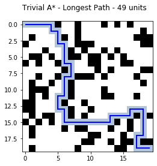
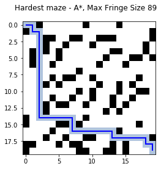
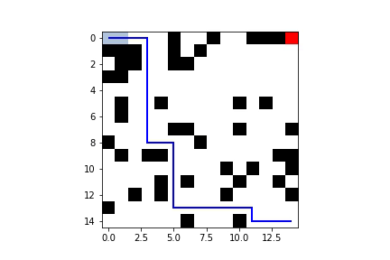
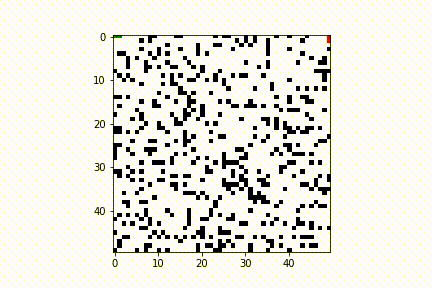
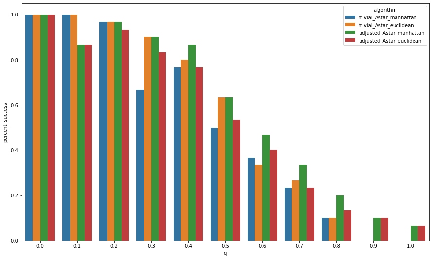

# maze search 

Implementation, visualization, and performance comparison of various search algorithms over a 2D maze with obstacles.  The search algorithms explored are: 
+ depth-first search (DFS) 
+ breadth-first search (BFS) 
+ A* search using Euclidean distance 
+ A* search using Manhattan distance 
+ Bi-directional BFS  
    * Two instances of BFS being executed at the same time. One instance starts at the start state and searches for the goal state. The other starts at the goal state and searches for the start state. The search will terminate when they encounter a common cell. At that point, the paths from the two searches are concatenated and returned.

## Fire simulation 

In this altered verious of the environment, a fire is started in the northeast corner of the 2D grid.  The fire grows according to a sample sampling technique based on predefined parameters.  The search is now more complex because the grid cells that are on fire must be avoided.  The algorithms' performance are now compared in this new situation.  Algorithms that incorporate heuristics (e.g. A* search) have an opportunity to better avoid the grid cells on fire.  

  

## Comparison 

## dev notes  

> merge notes 2019-09-26 16:47

+ Now part 2 complete.
+ Part 4 notebooks slightly revised.  
+ More images added 

> merge notes 2019-09-25 
 
+ Slight changes to all the search algorithms. Optimiziation by checking the closed_set before expanding state. 
+ Complete part 4.  See notebooks
+ Almost complete part 2.  See notebooks 

> merge notes 2019-09-24

+ A-star algorithm in search.py revised.  It is more robust to large dim now 
+ The closed_set and fringe arguments into the algorithms in search.py were removed.  That is dfs, bfs, A*, etc do not take closed_set and fringe as arguments.  The structures are created within the functions now.   
+ Roshan completed the A* search and trivial case for fire mazes
+ Jupyter notebooks created for each of the four parts of the project 

> merge notes 2019-09-19

+ ben completed A* (manhattan and euclidean) and bidirection bfs in object-oriented nature 
+ Adds fire mechanics and trivial solution to 4
+ Adds animation feature to Maze.  Can do it in two ways (see search-fire notebook)
    * SearchFire.animate(state_list)
    * Maze.animate_path(path)

> meeting notes - 2019-09-16 

+ merged master with roshan 
+ Ben to implement rest of searches in number 1 
+ Shyam to do number 3
	+ TODO ask prof if using randomness in search is okay.  Too similar to RW?
+ Roshan to do number 4
	+ Strategies 
		+ For cells in the fringe, check neighbors to see if they're on fire
		+ A* where cost of moving to a cell is its distance to a fire  
